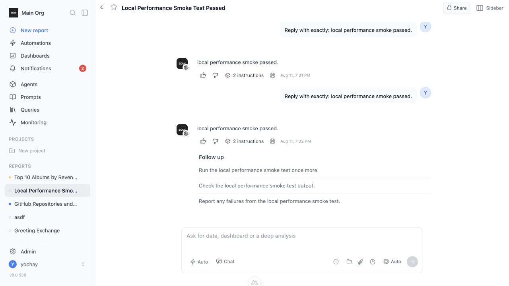
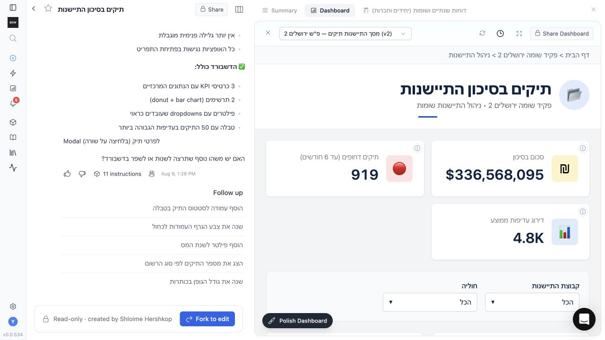

# Feedback Loop — report read path scales with history payloads

Opening and prompting in a report became progressively slower as its history
accumulated large query results. The worst reproduced report returned 109.8 MB
from the completions endpoint and needed 73.6 s end to end even though only a
small preview of each historical result was visible.

## Root causes (validated)

The delay was not an LLM-provider problem. It occurred before model streaming
and came from several additive read-path costs:

1. `CompletionService.get_completions_v2` hydrated and serialized the full
   completion graph, including multi-megabyte `Step.data` and duplicated tool
   result payloads. Historical data was repeatedly decoded from PostgreSQL,
   copied in Python, JSON-encoded, downloaded, and parsed in the browser.
2. The report page fetched its artifact twice, eagerly loaded full completions
   before showing the page, and requested every report query even when only one
   artifact was being rendered.
3. Artifact, query, and instruction loaders used broad ORM relationships whose
   mapper defaults pulled unrelated report history and large JSON columns.
4. Agent initialization rebuilt 75 Pydantic tool schemas on every turn because
   `ToolRegistry.register` bypassed the existing class metadata cache.
5. `Organization.get_settings` queried settings again even though the joined
   relationship was already present on the organization.
6. The first prompt handled by each worker also paid for lazy connector-client
   imports and tool discovery.

## Loop A — deterministic regression tests

The completion reproduction seeds the real report → completion → block → tool
execution → step graph with large result sets, then calls the production
serializer and asserts that response size is bounded while the canonical Step
still contains the complete data.

```bash
cd backend
.venv/bin/python -m pytest -q \
  tests/e2e/test_completions_v2_step_data_perf.py \
  tests/unit/test_artifact_relationship_loading.py \
  tests/unit/test_tool_registry_metadata_cache.py \
  tests/unit/test_organization_settings_cache.py \
  tests/unit/test_agent_runtime_warmup.py
```

Pre-fix observations on the large-history fixture:

| Endpoint | Time to first byte | Total | Response |
|---|---:|---:|---:|
| completions | 23.9 s | 73.6 s | 109.8 MB |
| report summary | 4.4 s | 13.6 s | 7.9 MB |

## The fix

- Persist bounded previews alongside full Step and tool data. New writes create
  the preview once; the migration fills previews for existing history without
  deleting or truncating canonical results.
- Project response-only previews at API boundaries and defer full JSON columns
  in list loaders. Full data remains available from the existing single-Step
  endpoint when a visible expanded tool card needs it.
- Load completion pages with a bounded window query and remove duplicate Step
  representations from embedded tool results.
- Narrow artifact, query, instruction, and report relationship loading; add
  indexes for the report-history joins used by those projections.
- Reuse `Tool.spec`'s process-local metadata cache and reuse joined organization
  settings. Pre-import active connector classes and populate tool metadata at
  worker startup so the first user prompt does not pay the lazy-import cost.
- Fetch one artifact in the report page, request only its queries, render the
  shell before completion history arrives, and lazily hydrate full Step data
  only for visible expanded result cards.

An attempted SQL JSON projection was rejected: PostgreSQL still had to parse
the multi-megabyte JSON values and took 16–18 s on the same fixture. Persisting
the compact representation makes work proportional to the preview, not the
historical result size.

## Loop B — live verification

The production-shaped environment was migrated, restarted, and checked through
the browser on both a normal report and an artifact-heavy report. No existing
report content was edited during page-load verification; prompts were run only
in a dedicated performance report.

Five-pass external measurements on the original large-history fixture after
the fix:

| Endpoint | Time to first byte | Total | Wire response |
|---|---:|---:|---:|
| report | 0.50–0.55 s | 0.50–0.55 s | bounded |
| completions | 0.64–0.67 s | 0.95–0.99 s | 64 KB compressed |
| report summary | 0.52–0.56 s | 0.52–0.56 s | 6.4 KB compressed |
| artifact | 0.51–0.52 s | 0.51–0.52 s | bounded |
| artifact queries | 0.50–0.54 s | 0.50–0.54 s | 5.4 KB compressed |

The remaining ~0.5 s in those command-line measurements is the external
TLS/network floor of a fresh connection; the browser reuses its connection.
The completions response is 378 KB uncompressed / 64 KB on the wire, down from
109.8 MB, while full results remain in their canonical Step rows.

Warm agent application work before the LLM fell to roughly 0.52 s, and the
browser displayed the model's exact-response answer in 2.66 s. A final clean
restart of the exact review tree reproduced that result at 2.67 s; static
context priming completed in 324 ms and the message refresh in 122 ms. The startup
prewarm moved the one-time connector/tool import cost out of the first prompt;
local cold startup warmed 75 tools and 4 active connector types in 322 ms, and
the production-shaped two-worker deployment warmed 75 tools and all 9 active
connector types per worker in 2.3–2.4 s before becoming healthy.

Browser evidence shows the product output is unchanged while the loading
behavior is bounded:

| Before | After |
|---|---|
|  |  |

The artifact page made exactly one artifact request, scoped its query request
to that artifact, removed all loading placeholders, and rendered the complete
dashboard in its iframe. Frontend static generation and the focused backend
regression suite (63 tests) pass.

## Regression boundary

- No canonical report, Step, artifact, query, or tool result data is removed.
- Small result sets keep their complete inline representation.
- Large historical results are hydrated on demand through the existing Step
  read contract, so expanding a visible card still shows the full result.
- Preview generation is defensive for legacy rows while migrations make the
  steady-state path independent of full JSON size.
- Startup warmup is best-effort; an optional connector import failure is logged
  and cannot prevent a worker from becoming healthy.
